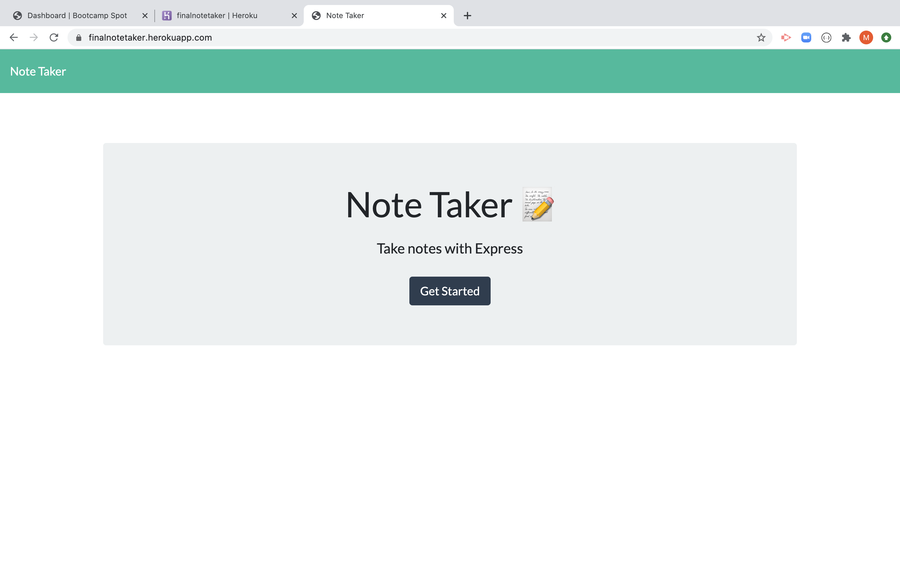
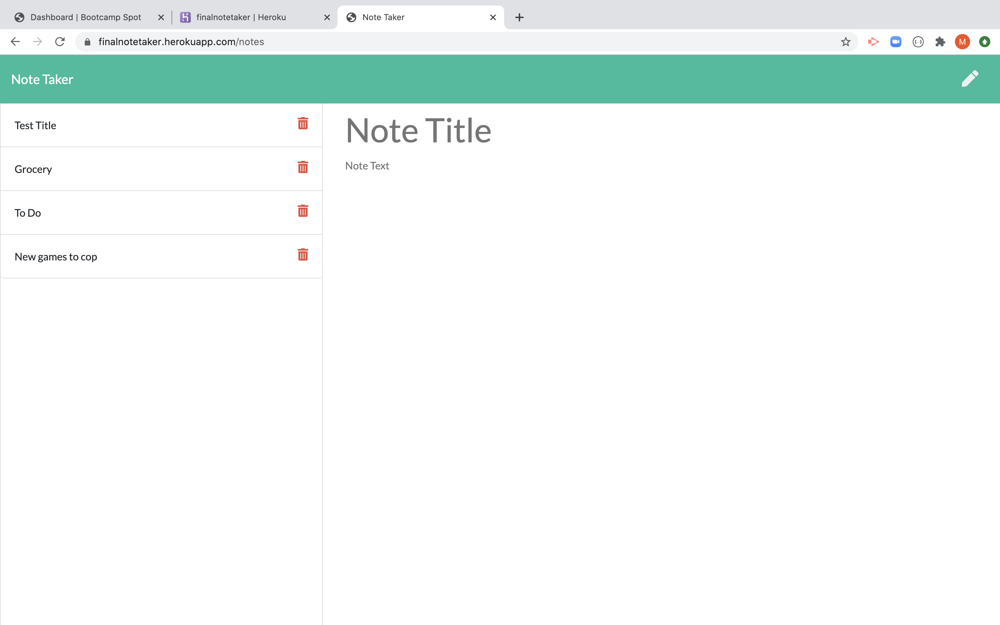

# Note Taker Express

# Project Summary:
In this project we will create an application that can be used to write, save, and delete notes. This application will use an express backend and save and retrieve note data from a JSON file.

# Table Contents: 
- [Description](#Description)
- [Installation Instructions](#Instructions)
- [Project Original Contributor](#Deployer)
- [Project Test](#Testing)
- [Project Contributors](#Contributors)
- [Github Repo](#Repo)
- [Heroku App](#Heroku)
- [Screenshot](#Screenshot)
- [Demo Link](#Demo)
- [Project Questions](#Questions)

# Description:
  This project was developed as a part of a homework assignment where we were asked to create a note taking application that can be used to write, save, and delete notes. This was achieve by using express backend. 

# Installation Instructions:
  First we copied the source code provided to us and maintained the folder structure. 
  Then we installed all the modules and packages like so. 
  ```
  npm i
  ```
  Doing so will give us all of the node modules and packages.json files. 

  After the application is created we will deploy it on heroku. 
  For this follow the following steps inside your terminal to make sure you have access to your heroku account.
  ```
  heroku login
  ```
  To ensure you login into your heroku account.
  ```
  heroku create
  ```
  To create an open application that will be deployed on your heroku dashboard. 

  Check for remote repositories by 
  ```
  git remote -v
  ```
  Once app is created and renamed you need to ensure you rename it on the terminal and update the remote repo link as follows:
  ```
  heroku git:remote -a"<new name>"
  ```
# Project Original Contributor:
  The project's source code was provided to us by the Teachers and TAs. The logic, routing files and database files were created by me. 

# Project Test:
  Link that shows the app being deployed from the terminal as well. 
- [Test](https://drive.google.com/file/d/1XRwjld4k7hr3aNhbhyCH78XWnKHVIfeI/view)

# Project Contributors:
  Anyone with a github account can contribute to this project. 

# Github Repo:
- [Repo](https://github.com/maurya512/Note_Taker)

# Heroku App:
- [App](https://finalnotetaker.herokuapp.com/)

# Screenshot:
  Screenshot of the home page


  Screenshot of the page where you can write,save and delete notes


# Demo Link:
  The Demo link that shows you how to access the app from my heroku dashboard.
- [Link](https://drive.google.com/file/d/1IRwlvlROgKHfzBOwor22QrPy2Htp64Hi/view)

# Questions:
  Any questions regarding this project can be directed at:
- [Github User](https://github.com/maurya512)
- [Email](patelmaurya0512@gmail.com)